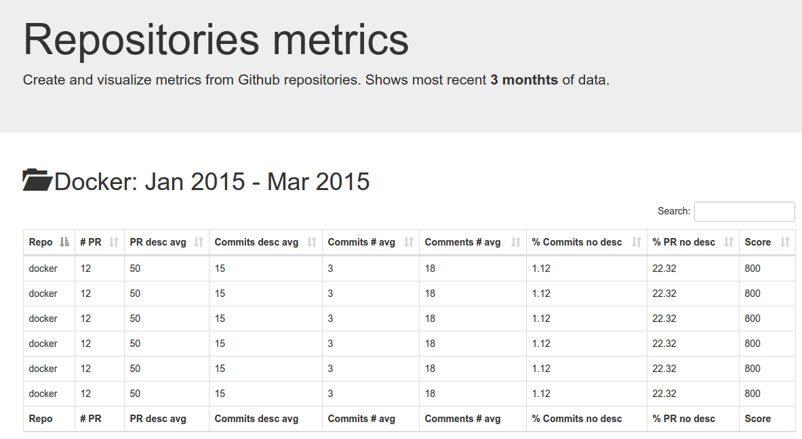

# Repos dashboard

Create table view of metrics for all repositories of a given Github organization.

## Getting started

The project is designed to be hosted on CDN (like S3).
**Following instructions are work in progress**

### Generate metrics data

Install `nodejs` and load repositories:
```js
var loader = require('./repo-loader.js')
var metrics = require('./repo-metrics.js')

loader.createCache('myOrganzation').then(function(data){
  metrics.generateFile(data)
})
```
### Dashboard view

Open `dashboard/index.html`



## Metrics supported

* [ ] Number of pull requests
* [ ] Average words per pull requests
* [ ] Average words per commit messages
* [ ] Average number of commits per pull requests
* [ ] Average number of comments per pull requests
* [ ] Percentage of commits without description
* [ ] Percentage of pull requests without description
