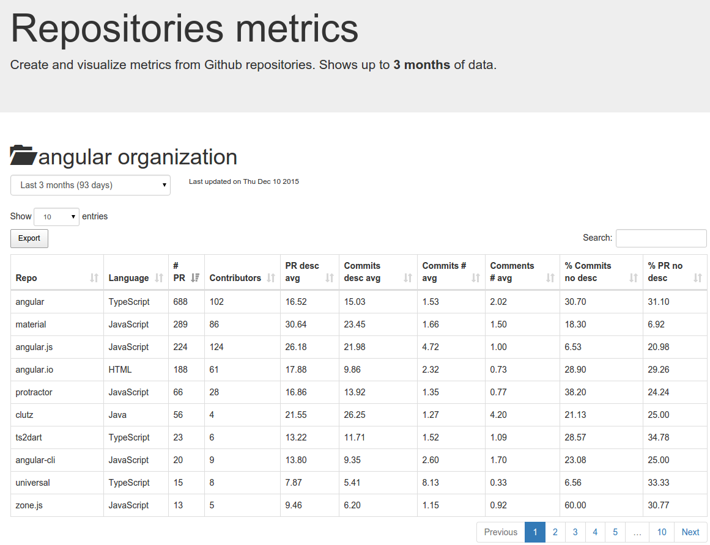

# Repos dashboard

Create table view of metrics for all repositories of a given Github organization.

* Query all `repos`, `pull requests`, `comments` and `commits` from github API
* Cache nested data locally in json format, one per pull requests
* Contains reusable functions in 3 modules `repo-metrics`, `repo-loader` and `repo-github`
* Create dashboard of metrics that can be hosted on a CDN (no dependencies)

## Getting started

* The project is designed to be hosted on CDN (like S3).
* Install dependencies `npm install`
* To generate the source documentation use: `.node_modules/.bin/jsdoc index.js modules/*.js --readme README.md`

### Generate metrics

1. Install `nodejs` if not yet done
2. Set github authentication environment variables (to increase API limit rates):
```sh
export GITHUB_USERNAME=my_username
export GITUHB_PASSWORD=my_password
```
2. Create repositories metrics from `nodejs`:
```js
var main = require('./index')
// 3 months of history and output in file (optional params)
main.generateMetrics('myOrganzation', 3, 'dashboard/metrics.json')
  .then(console.log).catch(console.log)
```

*Note: You might trigger an abuse detection mechanisme. Just try again after a
few minutes to finish caching your data locally.*

### Dashboard view

1. Make sure you have `dashboard/metrics.json` file generated
2. Run webserver: `./node_modules/.bin/http-server dashboard`
2. Open `http://localhost:8080`



## Features

### Metrics
* [X] Number of contributors (on PR creation)
* [X] Number of pull requests
* [X] Average words per pull requests
* [X] Average words per commit messages
* [X] Average number of commits per pull requests
* [X] Average number of comments per pull requests
* [X] Percentage of pull requests without description
* [X] Percentage of commits without description

### Dashboard
* [X] Filter metrics on previous months
* [X] Search rows in table
* [X] Export to csv/clipboard/pdf
* [X] Sort columns clicking on header
